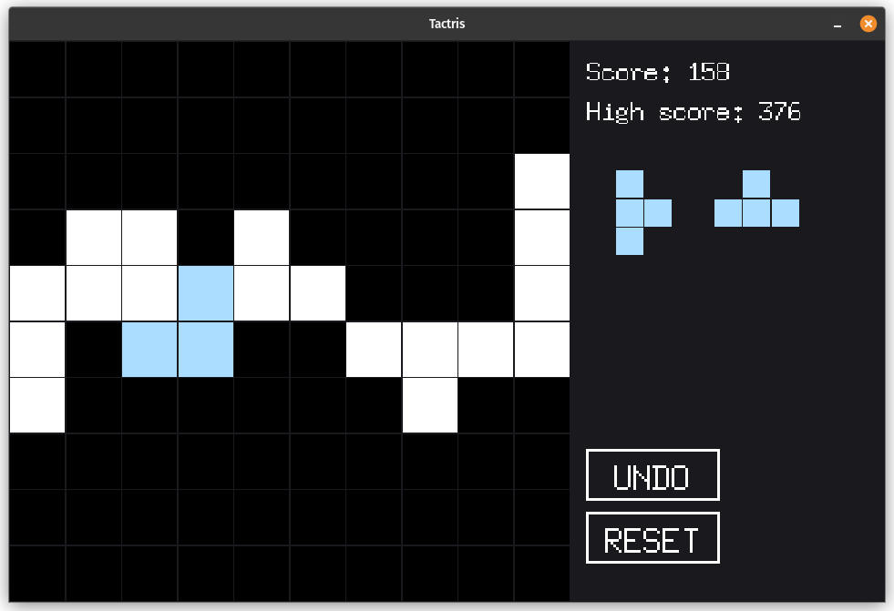

# Tactris

Tetris in reverse: draw shapes on a 10x10 grid to match the two target shapes,
complete rows and columns to clear them, and chase the high score.



## How to play

- Two target shapes are shown on the right. Click or drag across the grid to
  draw cells one at a time until your drawing matches either target.
- A full 4-cell match is placed on the board and scored. Stray cells that
  cannot belong to a target are erased automatically.
- Filling a full row or column clears it and scores bonus points. The cleared
  line moves to the nearest edge.
- UNDO reverts the last placed shape. RESET starts a new game. The game ends
  when neither target shape fits anywhere on the board.
- Your high score is saved to `highscore.txt` in the game directory.

## Requirements

- Go 1.27 or later

## How to run

```sh
go run .
```

Or build a binary and run it:

```sh
go build -o tactris .
./tactris
```

The window resizes freely; it snaps back to the game's aspect ratio when you
stop dragging.